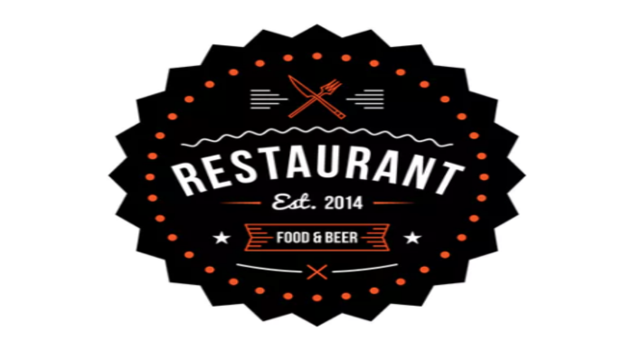

<h1 align="center"> Restau'GB </h1>  

  

    This project is the creation of a website with a management panel for a restaurant (TP for BTS SIO 1st year). Built with PHP 8.1.

  

  

<!-- START doctoc generated TOC please keep comment here to allow auto update -->
<!-- DON'T EDIT THIS SECTION, INSTEAD RE-RUN doctoc TO UPDATE -->
## Table of Contents

- [Introduction](#introduction)
- [Previews](#previews)
- [Features](#features)
- [Feedback](#feedback)
- [Contributors](#contributors)
- [Build Process](#build-process)

<!-- END doctoc generated TOC please keep comment here to allow auto update -->

## Introduction

## Previews

  
<strong>➡️ View (Website)</strong>

   
  <a href="https://restaugb.kozeuh-dev.fr">DEMO</a>

  
<strong>➡️ View (Management Panel)</strong>

   
  <a href="https://panel-restaugb.kozeuh-dev.fr">DEMO</a>

## Features

A few of the things you can do with Restau'GB :

### Website 🌐

* Display of the dish of the day, chosen from the Management Panel, according to day and month.
* Reservation module linked to the Management Panel to display the list of reservations.
* Contact module.

### Management Panel ⚙️

* Log in with username (firstname.lastname) and password (defined by an administrator)
* Create administrator account with 2 choices of permissions. (Access to reservation management and administrator accounts)
* Administrator account deletion.
* Reservation information & modification.
* Reservation cancellation.
* Sort reservations by date.

## Feedback

Feel free to send us feedback -> [file an issue](https://github.com/KoZeuh/RestauGB/issues/new). Feature requests are always welcome. If you wish to contribute, please take a quick look at the [guidelines](./CONTRIBUTING.md)!

## Contributors

[@KoZeuh](https://github.com/KoZeuh) (Management Panel)  
[@spaghefoo](https://github.com/spaghefoo) (Website)  
[@dylanlmr](https://github.com/dylanlmr) (Website)  

## Build Process

- Import SQL file. (`Panel_Gestion/SQL/restau_gb.sql`)
- Insert an Administrator account via the DB by inserting a password in MD5 format (https://md5decrypt.net/ <- To encrypt the desired password) 

----------------------------------------------------------------------------------------------------------------------------------------------------------------------------------------------------------------------------------------------------------

